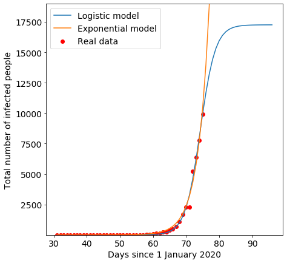

# A logistic and exponential model comparison applied to Covid-19

This is simple mathematical analysis of the infection growth to predict the
evolution of the coronavirus. The data collection used for this purpose is publicly
available as open data on github: 

- https://github.com/CSSEGISandData/COVID-19

Read the Johns Hopkins CSSE data repository terms of use for more information.

*Spain, 03-17-2020*